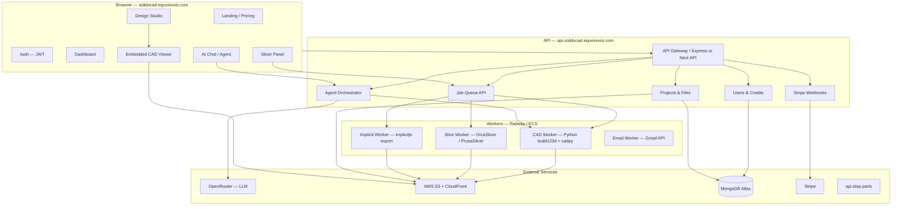

# SolidX CAD — Software Architecture

## 1. High-Level Diagram



## 2. Repository Layout (Recommended Monorepo Extension)

Keep **text-to-cad** as the skills/runtime source of truth. Add a new application layer:

```
text-to-cad/                    # existing repo (skills, viewer, packages)
apps/
  solidxcad-web/                # Next.js 15 — marketing + dashboard + studio
  solidxcad-api/                # Node API (or merge into web as /api)
  solidxcad-worker/             # BullMQ consumers + Python subprocess bridge
packages/
  solidxcad-shared/             # types, credit costs, API client
  solidxcad-ui/                 # dark theme design system (shadcn + tokens)
```

**Alternative:** separate Git repo `solidxcad-portal` with `text-to-cad` as git submodule at `vendor/text-to-cad`.

## 3. Service Responsibilities

### 3.1 Frontend (`solidxcad-web`)

| Module | Tech | Reuse from repo |
|--------|------|-----------------|
| Marketing | Next.js App Router | Adapt patterns from `docs/` site |
| Auth UI | NextAuth or custom JWT | New |
| Dashboard | React + TanStack Query | New shell |
| Design Studio | React layout | Compose `viewer/src/client` patterns |
| 3D Viewer | iframe or npm workspace import | **`packages/cadjs`**, **`packages/implicitjs`**, embed `viewer` workbench |
| AI Chat | Streaming SSE UI | New; streams from orchestrator |
| Slicer UI | Form + job status | Mirrors `skills/gcode` options |
| Parts browser | Search UI | Mirrors `skills/step-parts` + `step.parts/` catalog |

**Theme:** VS Code dark — see [UI-DESIGN.md](./UI-DESIGN.md).

### 3.2 API (`solidxcad-api`)

| Domain | Endpoints (examples) | Storage |
|--------|---------------------|---------|
| Auth | `POST /auth/register`, `/login`, `/refresh`, Google OAuth | MongoDB `users` |
| Users | `GET /me`, `PATCH /me` | MongoDB |
| Credits | `GET /credits`, ledger in `credit_transactions` | MongoDB |
| Projects | CRUD `/projects`, `/projects/:id/files` | MongoDB + S3 |
| Jobs | `POST /jobs/cad`, `/jobs/slice`, `GET /jobs/:id` | MongoDB + Redis queue |
| Agent | `POST /agent/chat` (SSE) | Ephemeral; debits credits |
| Stripe | `POST /billing/checkout`, webhook `/webhooks/stripe` | MongoDB `subscriptions` |
| Viewer assets | `GET /assets/:key` (signed CloudFront URLs) | S3 |

**Auth:** JWT access token (short) + refresh token (httpOnly cookie). Reuse pattern from your Enigma stack but **new JWT secret** for SolidX.

### 3.3 Agent Orchestrator

The orchestrator is the **product brain**. It does not reimplement CAD logic — it **calls the same skill scripts** the repo already ships.

```
User message
  → OpenRouter (tool-calling model, e.g. claude-sonnet / gpt-4o)
  → Tool: run_cad_skill(prompt, project_id)
  → Worker spawns: .venv/bin/python skills/cad/scripts/... 
  → Artifacts written to S3 under s3://{bucket}/solidxcad/{userId}/{projectId}/
  → Viewer URL returned with signed asset URLs
```

| Tool name | Maps to skill | Credit cost (initial) |
|-----------|---------------|----------------------|
| `generate_step` | `skills/cad` | 10 |
| `generate_implicit` | `skills/implicit-cad` | 8 |
| `search_parts` | `skills/step-parts` | 1 |
| `download_part` | `skills/step-parts` | 2 |
| `slice_gcode` | `skills/gcode` | 15 |
| `preflight_sendcutsend` | `skills/sendcutsend` | 5 |
| `generate_urdf` | `skills/urdf` | 12 |
| `inspect_geometry` | `skills/cad` inspect | 3 |

OpenRouter config:

```env
OPENROUTER_API_KEY=sk-or-...
OPENROUTER_BASE_URL=https://openrouter.ai/api/v1
OPENROUTER_MODEL_FAST=anthropic/claude-3.5-haiku
OPENROUTER_MODEL_CAD=anthropic/claude-sonnet-4
OPENROUTER_MODEL_VISION=openai/gpt-4o
```

Use **fast model** for chat/routing; **CAD model** for code generation inside build123d/implicit.js.

### 3.4 CAD Worker

**Runtime:** Docker image with:

- Python 3.11 + `skills/cad/requirements.txt` (build123d, OCP)
- Vendored `packages/cadpy` on `PYTHONPATH`
- Node 20 for `implicitjs` CLI exports
- Read-only copy of `skills/` from bundle (`scripts/bundle/bundle.sh` output)

**Job flow:**

1. Pull job from Redis (BullMQ).
2. Materialize prompt + context to temp workspace `/tmp/job-{id}/`.
3. Agent loop OR direct script invocation generates `.step`, sidecar `.glb`, `.topology.json`.
4. Upload to S3; update MongoDB job `status: completed`, `artifacts: [...]`.
5. Deduct credits atomically (transaction).

**Scaling:** One GPU not required for B-Rep; CPU workers horizontally scaled. Implicit raymarch preview runs in browser; mesh export can use worker CPU.

### 3.5 Slice Worker

Wraps `skills/gcode/scripts/gcode_tool.py`:

- Input: STL/3MF/GLB mesh from S3
- Printer profile: user-uploaded or preset (Bambu, Prusa, etc.)
- Output: `.gcode` to S3
- Optional: preview toolpath via `cadjs` gcode mesh builder in viewer

**Deployment note:** Slicers need **Linux CLI binaries** in the worker image (OrcaSlicer headless). This is the hardest ops piece — budget 1–2 weeks for containerization.

### 3.6 Storage Model (S3)

```
{s3_folder_prefix}/solidxcad/
  users/{userId}/
    projects/{projectId}/
      models/part_v1.step
      models/part_v1.glb          # cadpy sidecar
      models/part_v1.topology.json
      slices/job_abc.gcode
      implicit/model.implicit.js
      exports/
```

CloudFront signed URLs for viewer; never expose bucket publicly.

### 3.7 MongoDB Collections

| Collection | Key fields |
|------------|------------|
| `users` | email, passwordHash, plan, creditsBalance, stripeCustomerId |
| `credit_transactions` | userId, delta, reason, jobId, createdAt |
| `projects` | userId, name, thumbnail, updatedAt |
| `files` | projectId, s3Key, mime, kind (step\|stl\|gcode\|...) |
| `jobs` | type, status, input, output, error, creditsCharged |
| `subscriptions` | userId, stripeSubscriptionId, plan, status |
| `agent_sessions` | projectId, messages[], tokenUsage |

## 4. CAD Viewer Integration

**Option A (MVP, fastest):** Embed existing viewer in iframe

```
https://solidxcad.equvinoxis.com/viewer?dir={signedCatalogApi}&file={relativePath}
```

Host a **viewer API shim** that maps `?dir=` to user's S3 project prefix via `GET /api/projects/:id/catalog`.

**Option B (production):** Import `viewer` as workspace package

- `npm` workspace: `@solidxcad/viewer` → symlink `viewer/`
- Replace local FS backend with `S3AssetBackend` implementing same interface as `viewer/src/server/localAssetBackend.mjs`
- Reuse `viewer/src/client/workbench` for studio center panel

Key viewer routes to reimplement for cloud:

| Local route | Cloud equivalent |
|-------------|------------------|
| `/__cad/catalog` | `GET /api/projects/:id/catalog` |
| `/__cad/asset` | `GET /api/assets/:key` (signed) |
| `/__cad/step-artifact` | `POST /api/jobs/step-artifact` |
| `/__cad/implicit-export` | `POST /api/jobs/implicit-export` |

## 5. Payments (Stripe)

| Plan | Price | Credits | Stripe |
|------|-------|---------|--------|
| **Free** | $0 | 100 one-time (signup) | No subscription |
| **Pro** | $20/mo | TBD (e.g. 500/mo) | `price_xxx` subscription |

Flow:

1. `POST /billing/checkout` → Stripe Checkout Session
2. Webhook `checkout.session.completed` → set plan, grant credits
3. Webhook `invoice.paid` → monthly credit top-up
4. `customer.subscription.deleted` → downgrade to free

Keep Razorpay out of SolidX unless you add INR pricing later.

## 6. Deployment Topology

| Service | Host | Domain |
|---------|------|--------|
| Web + API | Vercel or Railway | `solidxcad.equvinoxis.com`, `api.solidxcad.equvinoxis.com` |
| Workers | Railway (Docker) | internal |
| MongoDB | Atlas (existing cluster, **new DB** `solidxcad`) | — |
| S3 + CloudFront | AWS (existing bucket, new prefix) | CDN for assets |
| Redis | Upstash or Railway | job queue |
| Stripe | Stripe Dashboard | webhooks → API |

## 7. Security

- Per-user S3 prefix isolation; signed URLs expire in 15 min
- Workers run jobs in sandboxed temp dirs; no cross-user paths
- Rate limit: auth 5/min, agent 20/hr free, 200/hr pro
- Admin panel at `/admin` — `ADMIN_EMAIL` only, separate role
- **Never** pass LLM the raw JWT or AWS keys
- Rotate all secrets if exposed; use `docs/portal/ENV.example` only in git

## 8. What We Cannot Clone Quickly (CadX Gaps)

| CadX feature | Our path | Effort |
|--------------|----------|--------|
| In-browser B-Rep kernel editor | Use agent-generated STEP + viewer inspect; no native sketch/extrude UI in v1 | Months |
| Real-time multi-user editing | Phase 3 — Yjs + WebSocket on project state | Weeks |
| Git branches for CAD | Phase 3 — version graph on S3 + MongoDB | Weeks |
| Native CAM workbench | gcode skill + viewer toolpath preview | Weeks (slice worker) |
| DFM / FEA | Future — integrate external solver or LLM heuristics | Months |

**Our MVP advantage:** mature **skills pipeline** (STEP, slice, robots, step.parts) vs building kernel from scratch.

## 9. API ↔ Skill Script Mapping

| User action | API job type | Script entrypoint |
|-------------|--------------|-------------------|
| "Make a bracket 50×30mm" | `cad_generate` | `skills/cad/scripts/` via agent-generated Python |
| "Show M3 screw 20mm" | `parts_search` | `skills/step-parts/scripts/download_step_part.py` |
| "Slice for Bambu P1S" | `gcode_slice` | `skills/gcode/scripts/gcode_tool.py slice` |
| "Preview in browser" | `viewer_open` | Return catalog URL for embedded viewer |
| "Export STL" | `cad_export` | `packages/cadpy` STL export |
| "Robot arm URDF" | `urdf_generate` | `skills/urdf/scripts/` |

## 10. Observability

- Structured logs: job id, user id, skill, duration, credits
- Sentry on web + API + workers
- Stripe + OpenRouter cost per user for margin tracking
- Health: `GET /health`, worker heartbeat in Redis
